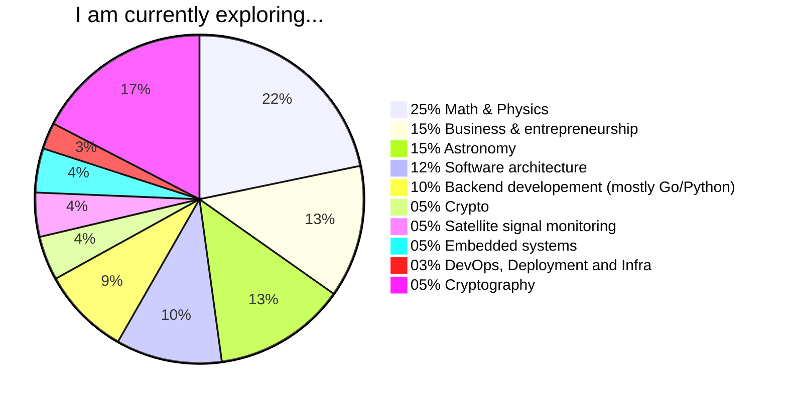
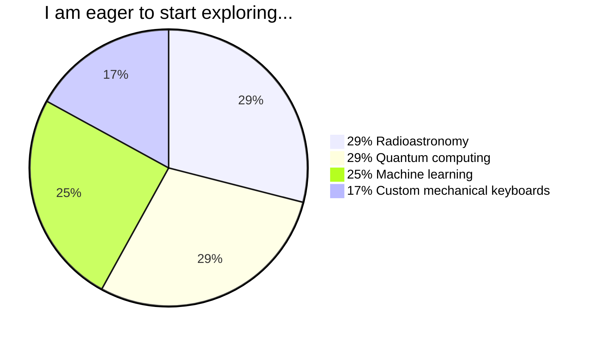

# Hi there and welcome to my profile!

I enjoy building things, breaking things, and figuring out how they work.

I have a really diverse range of interests, so it's simpler to have them displayed as a couple of pie charts...

## What I am into right now
This pie chart shows the topics I'm actively exploring

> [!NOTE]
> The percentages reflect my current curiosity level, not my expertise. And of course, they're just rough estimates.

## Topics I'm eager to start exploring
Topics I'm excited about but haven't had time to dig into yet

> [!NOTE]
> Same here - the percentages are just my curiocity level.

## Project highlights
Some of the projects I work(ed) on.

#### Python packages:
- [mc.py](https://github.com/jieggii/mc.py): generate funny phrases using Markov chains
- [minicfg](https://github.com/jieggii/minicfg): configure your Python microservices the easy way

#### Go packages:
- [ecbratex](https://github.com/jieggii/ecbratex): convert currencies (you can also travel in time if you need to)

#### Telegram bots:
- [podcastie](https://github.com/jieggii/podcastie): follow and listen to your favorite podcasts in Telegram

#### Devices:
- [env-server](https://github.com/jieggii/env-server): air quality in your office back to your control
- [everlasting-brithday-card](https://github.com/jieggii/everlasting-birthday-card): blow out the candle every year on your birthday (POC)

#### Tools:
- [dcfg](https://github.com/jieggii/dcfg): store your dotfiles in a git repo
- [mkpp](https://github.com/jieggii/mkpp): create python packages using this tool and save 3 seconds

#### Experiments:
- [multidimensional-battleship](https://github.com/jieggii/multidimensional-battleship): play battleship in multiple dimensions (for real)

